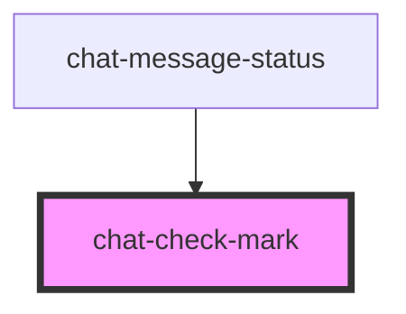

# chat-check-mark

<!-- Auto Generated Below -->

## Properties

| Property | Attribute | Description | Type             | Default |
| -------- | --------- | ----------- | ---------------- | ------- |
| `ticks`  | `ticks`   |             | `"one" \| "two"` | `'one'` |

## Dependencies

### Used by

 - [chat-message-status](../message-status)

### Graph

----------------------------------------------

*Built with [StencilJS](https://stenciljs.com/)*
