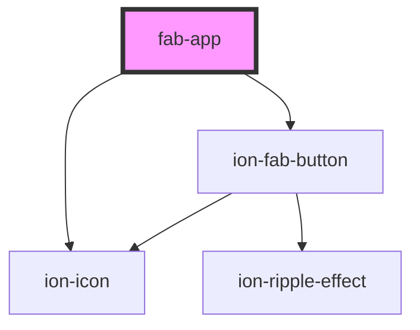

# fab-app

<!-- Auto Generated Below -->

## Properties

| Property  | Attribute | Description | Type     | Default          |
| --------- | --------- | ----------- | -------- | ---------------- |
| `ionicon` | `ionicon` |             | `string` | `"code-working"` |

## Methods

### `close() => Promise<void>`

#### Returns

Type: `Promise<void>`

## Dependencies

### Depends on

- ion-fab-button
- ion-icon

### Graph

----------------------------------------------

*Built with [StencilJS](https://stenciljs.com/)*
