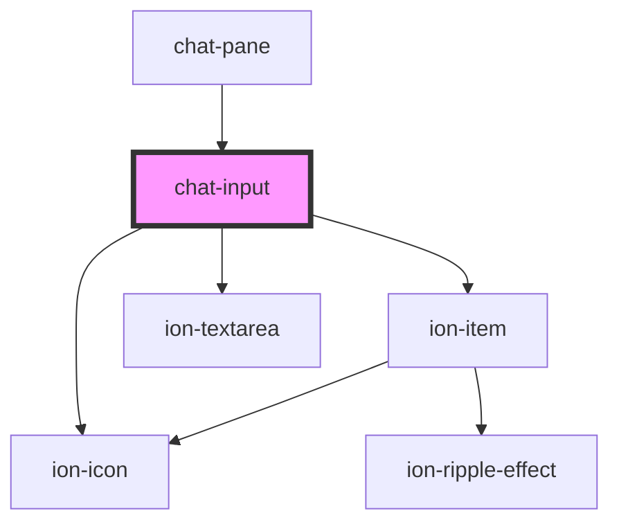

# chat-input

<!-- Auto Generated Below -->

## Events

| Event  | Description | Type                                          |
| ------ | ----------- | --------------------------------------------- |
| `send` |             | `CustomEvent<AssisterInputChangeEventDetail>` |

## Dependencies

### Used by

 - [chat-pane](../pane)

### Depends on

- ion-icon
- ion-item
- ion-textarea

### Graph

----------------------------------------------

*Built with [StencilJS](https://stenciljs.com/)*
