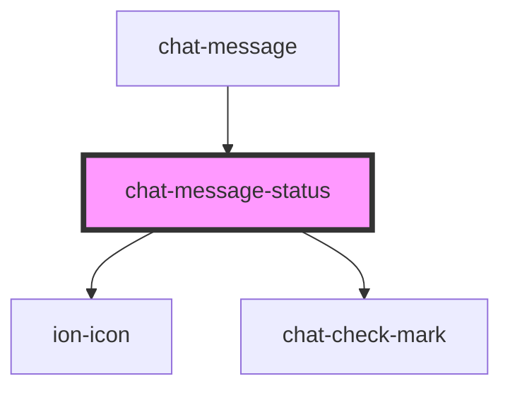

# chat-message-status

<!-- Auto Generated Below -->

## Properties

| Property | Attribute | Description | Type                                           | Default     |
| -------- | --------- | ----------- | ---------------------------------------------- | ----------- |
| `state`  | `state`   |             | `"delivered" \| "none" \| "pending" \| "read"` | `'pending'` |

## Dependencies

### Used by

 - [chat-message](../message)

### Depends on

- ion-icon
- [chat-check-mark](../check-mark)

### Graph

----------------------------------------------

*Built with [StencilJS](https://stenciljs.com/)*
