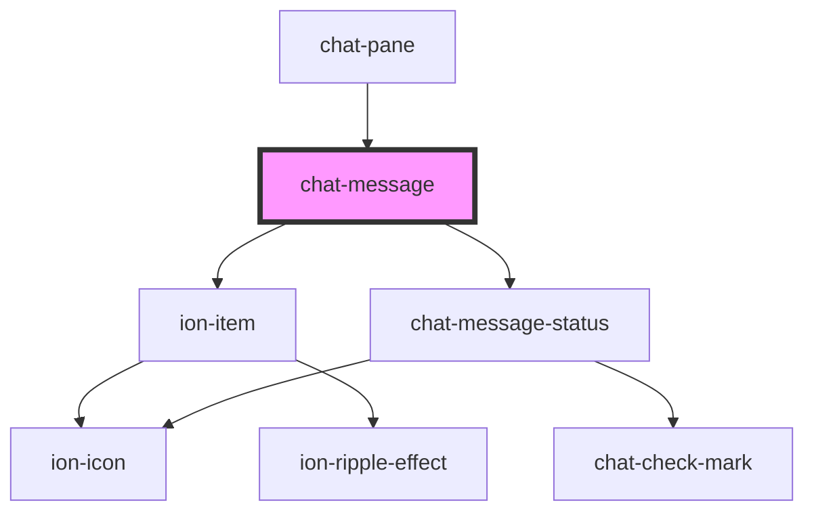

# chat-message

<!-- Auto Generated Below -->

## Properties

| Property    | Attribute   | Description | Type                                           | Default      |
| ----------- | ----------- | ----------- | ---------------------------------------------- | ------------ |
| `direction` | `direction` |             | `"incoming" \| "outgoing"`                     | `'outgoing'` |
| `footer`    | `footer`    |             | `string`                                       | `undefined`  |
| `state`     | `state`     |             | `"delivered" \| "none" \| "pending" \| "read"` | `'none'`     |
| `triangle`  | `triangle`  |             | `"bottom" \| "none" \| "top"`                  | `'bottom'`   |

## Dependencies

### Used by

 - [chat-pane](../pane)

### Depends on

- ion-item
- [chat-message-status](../message-status)

### Graph

----------------------------------------------

*Built with [StencilJS](https://stenciljs.com/)*
