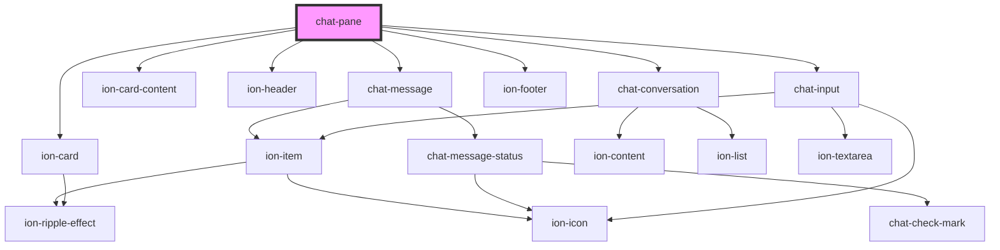

# chat-pane

<!-- Auto Generated Below -->

## Properties

| Property                     | Attribute  | Description | Type                              | Default                  |
| ---------------------------- | ---------- | ----------- | --------------------------------- | ------------------------ |
| `mapInputTextToHtmlElements` | --         |             | `(text: string) => HTMLElement[]` | `createElementsFromText` |
| `triangle`                   | `triangle` |             | `"bottom" \| "none" \| "top"`     | `'bottom'`               |

## Events

| Event      | Description | Type                               |
| ---------- | ----------- | ---------------------------------- |
| `incoming` |             | `CustomEvent<IncomingEventDetail>` |

## Methods

### `addCard({ text, image }: { text?: string; image?: string; }) => Promise<HTMLElement>`

#### Returns

Type: `Promise<HTMLElement>`

### `addIncomingMessage(text: string) => Promise<HTMLElement>`

#### Returns

Type: `Promise<HTMLElement>`

### `addOutgoingMessage(text: string) => Promise<HTMLElement>`

#### Returns

Type: `Promise<HTMLElement>`

## Dependencies

### Depends on

- [chat-message](../message)
- ion-card
- ion-card-content
- ion-header
- [chat-conversation](../conversation)
- ion-footer
- [chat-input](../input)

### Graph

----------------------------------------------

*Built with [StencilJS](https://stenciljs.com/)*
