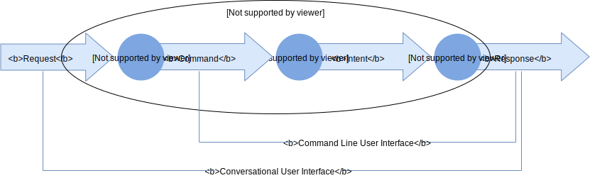

# Assister - Terms and Functions Language and the Functional Knowledge Graph

- Start Date: 2018-08-20
- Master Issue: [#2](https://github.com/assister-ai/assister/issues/2)
- RFC PR: [#4](https://github.com/assister-ai/assister/pull/4)

## Summary
[summary]: #summary

[Assister](#the-assister-platform-tapassister) is an
[open source](https://en.wikipedia.org/wiki/Open_source),
[open platform](https://en.wikipedia.org/wiki/Open_platform) for integrating
[context-sensitive](https://en.wikipedia.org/wiki/Context-sensitive_user_interface)
[conversational user interfaces](https://en.wikipedia.org/wiki/Conversational_user_interfaces)
and [command line user interfaces](https://en.wikipedia.org/wiki/Command-line_interface)
in [application softwares](https://en.wikipedia.org/wiki/Application_software).
Assister introduces the concept of [**Functional Knowledge Graph (FKG)**](#functional-knowledge-graph-fkg)
and standardizes a new [metalanguage](https://en.wikipedia.org/wiki/Metalanguage)
for creating FKGs, the [**Terms and Functions (TFx)** language](#terms-and-functions-language-tfx).
Assister ships with the [reference implementation](https://en.wikipedia.org/wiki/Reference_implementation)
of TFx for [web applications](https://en.wikipedia.org/wiki/Web_application),
the [**Assister Agent**](#assister-agent).

### Assister Pipeline
[assister-pipeline]: (#assister-pipeline)



*Assister [Pipeline](https://en.wikipedia.org/wiki/Pipeline_(computing)),
references: [Request](#guide-level-explanation),
[Discovery](#discovery),
[Command](#command),
[Terminology](#terminology),
[Intent](#intent),
[Execution](#execution),
[Response](#response)*

## Motivation
[motivation]: #motivation

[Conversational user interfaces](https://en.wikipedia.org/wiki/Conversational_user_interfaces)
(CUIs) are a relatively new concept. Conversing with an ideal CUI would be
indistinguishable from a conversation with a real human.
[Google Duplex](https://ai.googleblog.com/2018/05/duplex-ai-system-for-natural-conversation.html)
is an example of a state-of-the-art CUI; human subjects did not grasp they
were talking to an [Artificial Intelligence](https://en.wikipedia.org/wiki/Artificial_intelligence)
in some tests.

CUIs are probably our best try yet at a [Natural User Interface](https://en.wikipedia.org/wiki/Natural_user_interface).


*[KnowsMore](https://www.imdb.com/title/tt5848272/characters/nm0876138),
an animated character in [Ralph Breaks the Internet](https://www.imdb.com/title/tt5848272/),
manifestation of an ideal CUI!
Image by [IMDB](https://www.imdb.com/title/tt5848272/mediaviewer/rm559510784)*

Despite showing promise in [lifestyle](https://en.wikipedia.org/wiki/Lifestyle_(sociology))
use cases, [virtual assistants](https://en.wikipedia.org/wiki/Virtual_assistant)
have been mostly unsuccessful in breaking new ground for [professionals](https://en.wikipedia.org/wiki/Professional).
This is partly due to the complex variables at play in a professional setting,
which are hard to comprehend without [context](https://en.wikipedia.org/wiki/Context_(language_use))
(case study: [IBM Watson in Health](https://www.computerworld.com/article/3321138/did-ibm-put-too-much-stock-in-watson-health-too-soon.html)).

Assister is an effort aimed at solving this problem over [the web](https://en.wikipedia.org/wiki/World_Wide_Web),
by provision of [a standard](#functional-knowledge-graph-fkg)
for contextual [text annotations](https://en.wikipedia.org/wiki/Text_annotation),
and [an accompanying](#assister-agent)
[browser extension](https://en.wikipedia.org/wiki/Browser_extension)
for creating CUIs that operate on these annotations.

### User-level requirements
[user-level-requirements]: #user-level-requirements

* I don't want to memorize the position of `format as date` in all
[spreadsheet]((https://en.wikipedia.org/wiki/Spreadsheet)) applications.
* Show me the `potential customers` that `I` flagged as `lead` between
`January` and `February`.

## Guide-level explanation
[guide-level-explanation]: #guide-level-explanation

A [Conversational User Interface (CUI)](](https://en.wikipedia.org/wiki/Conversational_user_interfaces))
receives a `request` from the [user](https://en.wikipedia.org/wiki/User_(computing))
in form of [natural language](https://en.wikipedia.org/wiki/Natural_language)
and emits a human-understandable `response`, either as [visuals](https://en.wikipedia.org/wiki/Visual_communication)
or [simulated human voice](https://en.wikipedia.org/wiki/Speech_synthesis),
in return. All within an [operating system](https://en.wikipedia.org/wiki/Operating_system).


*Siri. Image by [Wikimedia](https://en.wikipedia.org/wiki/File:Siri_on_iOS.png)*

A [Command Line user Interface (CLI)](https://en.wikipedia.org/wiki/Command-line_interface)
provides an interface for receiving [`commands`](https://en.wikipedia.org/wiki/Command_(computing))
from the user and outputs the corresponding `result` after execution.


*An MS DOS command line. Image by [Wikimedia](https://commons.wikimedia.org/wiki/File:COMMAND_LINE.svg)*

A CUI can be thought of an *extension* of a CLI if one compares the two. CUI
takes a request, runs a series of commands and outputs a response based
on the results.

Assister creates [a CLI](#assister-agent) for the web, and automate the
creation of CUIs over this CLI.

### Discovery
[discovery]: #discovery

A `discovery` is any software that maps requests to commands. Using
[Natural Language Understanding](https://en.wikipedia.org/wiki/Natural-language_understanding)
coupled with [Machine Learning](https://en.wikipedia.org/wiki/Machine_learning)
over the [Terms and Functions](#terms-and-functions-language-tfx)
contextual annotations embedded in an application, a discovery can translate a
request to the corresponding command. The command will then be executed within
the [Assister Pipeline](#assister-pipeline).

Following a [batteries included philosophy](https://www.python.org/dev/peps/pep-0206/#batteries-included-philosophy),
[Assister](#the-assister-platform-tapassister) comes pre-equipped with an open
source discovery, the [Assister Map](#assister-map).
Being an [open architecture](https://en.wikipedia.org/wiki/Open_architecture)
design however, Assister accommodates swapping for another discovery, for
example with proprietary solutions like [Apple Siri](https://www.apple.com/siri/),
[Google Assistant](https://assistant.google.com/),
[Amazon Alexa](https://developer.amazon.com/alexa) or
[Microsoft Cortana](https://www.microsoft.com/en-ca/windows/cortana).

### Functional Knowledge Graph (FKG)
[functional-knowledge-graph-fkg]: #functional-knowledge-graph-fkg

Knowledge Graph (also known as [ontology](https://en.wikipedia.org/wiki/Ontology_(information_science)))
is the [de facto standard](https://en.wikipedia.org/wiki/De_facto_standard)
in context provision for virtual assistants. A Knowledge Graph describes the
entities and relations that a virtual assistant should operate upon. A
Knowledge Graph is then hardwired in an operating system's predefined
[execution](https://en.wikipedia.org/wiki/Execution_(computing))
capabilities to provide a set of functionalities offered by the [vendor](https://en.wikipedia.org/wiki/Vendor).

A `Functional Knowledge Graph` (FKG) extends the Knowledge Graph concept by
including the references to pieces of [executable](https://en.wikipedia.org/wiki/Executable)
software that carry out the functionalities.

An FKG is an Ontology that encompasses the [implementation](https://en.wikipedia.org/wiki/Implementation)
context as well as the [data model](https://en.wikipedia.org/wiki/Data_model)
in a [domain](https://en.wikipedia.org/wiki/Domain_(software_engineering)).

### Terms and Functions Language (TFx)
[terms-and-functions-language-tfx]: #terms-and-functions-language-tfx

**Terms and Functions (TFx)** is a [domain-specific](https://en.wikipedia.org/wiki/Domain-specific_language)
metalanguage for describing the terms used by the users of an application and
the relation of these terms with the code that an application is made of.

TFx offloads the task of describing the entities and relations to an [object](https://en.wikipedia.org/wiki/Object_language)
programming language and the native data model of an application. TFx
constitutes an FKG by directly referencing the functions and variables in an
application's code and encoding their relation with a domain's [`terminology`](https://en.wikipedia.org/wiki/Terminology).

In more technical terms, TFx is a [dynamic](https://en.wikipedia.org/wiki/Dynamic_programming_language)
[metaprogramming](https://en.wikipedia.org/wiki/Metaprogramming)
[language](https://en.wikipedia.org/wiki/Programming_language)
with a [metasyntax](https://en.wikipedia.org/wiki/Metasyntax)
that can describes the connection between a domain and a programming object
languages. TFx enables the encoding of a domain-specific terminology and its
correspondence with its [`execution`](#execution) context.

The TFx metasyntax is standardized by [TAC](#the-assister-platform-tapassister).

#### Terminology
[terminology]: #terminology

In TFx, a `terminology` is a set of terms in a domain which are used in [`commands`](#command)
along with their [parsing](https://en.wikipedia.org/wiki/Parsing) mechanism.

#### Execution
[execution]: #execution

An `execution` is defined as a subset of functions and variables from an
object programming language that are used to deliver the functionality of
commands.

#### Command
[command]: #command

A command in TFx is a term in a domain that is `executable` by its `intent`.

#### Intent
[intent]: #intent

An `intent` is a a reference to a variable or a function call from variables
and functions defined in execution to be evaluated at the execution stage
conditioned by presence of a set of variables specified by the intent.

#### TFx Example
[tfx-example]: #tfx-example

TFx declarations are located at the `<head>` of an [HTML file](https://www.w3schools.com/html/html_intro.asp)
within [`<meta>`](https://www.w3schools.com/tags/tag_meta.asp) tags, though an
[XML](https://en.wikipedia.org/wiki/XML) equivalent will be used in this
example for reader's comfort.

Some TFx attributes reference JavaScript variables:

```html
<meta property="tfx:function" name="format"/>
```

Here `format` is a JavaScript function referenced in the `name` attribute.

Consider the following JavaScript code, `sheet.js`, for a hypothetical
spreadsheet application as the basis for the example:

```js
import { useState } from 'react';

const types = {
    date: Date,
    number: Number,
    // etc.
};

const [currentSelection, setCurrentSelection] = useState('A1');

function format(selection, type) {
    // formats selection as type
    // e.g. selection = 'J9:K14,L9,M9,N9:O14,K17:N25'
    // e.g. type = types.date
}

export { types, currentSelection, setCurrentSelection, format };
```

[useState](https://reactjs.org/docs/hooks-state.html) is an example of state
management in [React](https://reactjs.org/).

The following TFx annotation exposes a `command`, `format`, for this JavaScript code,
addressing the `format as date` user scenario [mentioned earlier](#user-level-requirements).

```xml
<terminology uri="spreadsheet:terms/sheet">
    <term name="type">
        <case pattern="number">
        <case pattern="date">
    </term>

    <term name="cell" pattern="${'A':'Z' 0:N}"/>
    <term name="range"
        description="A ${range} is an (interval)[https://en.wikipedia.org/wiki/Interval_(mathematics)] of ${cell}s with a ${start} and an ${end}"
        more="https://www.computerhope.com/jargon/r/range.htm"
    />
        <term name="start" isa="cell"/>
        <term name="end" isa="cell"/>
        <case pattern="${start ':' end}"/>
    </term>
    <term name="selection"
        pattern="${((cell ',') | (range ',')) ... cell | range}"
    />
</terminology>

<execution uri="spreadsheet:sheet" module="./sheet.js">
    <function name="format"/>
    <function name="setCurrentSelection"/>

    <variable name="types"/>
    <variable name="currentSelection"/>
</execution>

<command name="format" pattern="format ${selection | ''} as ${type}">
    <variable name="selection" term="selection">
    <variable name="type" term="type" map="type => types[type]">
    <intent given="[selection, type]" value="format(selection, type)">
        <effect then="() => setCurrentSelection(selection)"/>
        <example command="format J9:K14,L9,M9,N9:O14,K17:N25 as number"
            given="[selection, type]"
            equals="['J9:K14,L9,M9,N9:O14,K17:N25', types['number']]"
        />
    </intent>
    <intent given="[type]" value="format(currentSelection, type)">
        <example command="format as date" given="[type]" equals="[types['date']]">
    </intent>
</command>
```

The command tag describes a [class](https://en.wikipedia.org/wiki/Categorical_variable)
of commands and their mapping to their intents.

The grammar used in the `pattern` attributes is [PTRN](#ptrn-grammar).

Two methods for invoking the `format` function are addressed in the above
example, one which formats the `currentSelection` and another where the
user specifies which cells are to be formatted.

Initial proposals for the TFx metasyntax are discussed in [Reference-level explanation](#reference-level-explanation).

#### TFx and Context
[tfx-and-context]: (#tfx-and-context)

The advantage of having TFx declarations inside HTML is that an application
author can design context-sensitive commands. This can be achieved by the
widely popular [DOM manipulation](https://developer.mozilla.org/en-US/docs/Learn/JavaScript/Client-side_web_APIs/Manipulating_documents)
technique via JavaScript. The author can fill JavaScript variables based on
the previous command interactions and accordingly add or remove TFx annotations
in the appropriate context.

### PTRN Grammar
[ptrn-grammar]: (#ptrn-grammar)

Parsing Term Returning Name (PTRN) Grammar is a [high-level](https://en.wikipedia.org/wiki/High-level_programming_language)
derivative of [Parsing Expression Grammar (PEG)](https://en.wikipedia.org/wiki/Parsing_expression_grammar)
for describing patterns in a terminology. PTRN is standardized and developed
by TAC specifically for usage in TFx. The most important factor in PTRN's
design is its [ergonomics](https://en.wikipedia.org/wiki/Human_factors_and_ergonomics),
PTRN should strive to have minimal [cognitive load](https://en.wikipedia.org/wiki/Cognitive_load),
as expected from an annotation language. Alternatives like
[JavaScript Regular Expressions](https://developer.mozilla.org/en-US/docs/Web/JavaScript/Guide/Regular_Expressions)
are therefore dismissed. Initial proposals for PTRN are discussed in
[Reference-level explanation](#reference-level-explanation).

### Assister Agent
[assister-agent]: #assister-agent

Assister Agent is the CLI for running commands annotated by TFx. As
opposed to a traditional [terminal user interface](https://en.wikipedia.org/wiki/Text-based_user_interface)
where CLIs normally operate, the Agent is a browser extension with an
[instant messaging](https://en.wikipedia.org/wiki/Instant_messaging) interface,
emulating a conversation with the application.


*Instant messaging in Telegram Messenger. Image by [Telegram](https://telegram.org/)*

#### Response
[response]: #response

A `response` is a value resulted from a [command](#command) execution.

Responses are presented to the user as [`cards`](https://material.io/design/components/cards.html).


*Card interface. Image by [material.io](https://material.io/design/components/cards.html)*

Application authors can ship their own custom card for a command. Optionally
they can have cards that are automatically generated by the Agent, given
the variable or the return value of the JavaScript function denoted by the
command's intent is in [JSON-LD](https://en.wikipedia.org/wiki/JSON-LD)
format and its TFx declaration is annotated by a type from
[shema.org](https://schema.org/):

```xml
<function name="getAge" schema="http://schema.org/Number"/>
```

### Assister Map
[assister-map]: #assister-map

Assister Map is discussed in detail in [its own](#todo)
[RFC](https://github.com/assister-ai/assister/blob/master/rfcs/README.md).
MAP ships with the Agent as the default discovery.

### The Assister Platform (TAP/Assister)
[the-assister-platform-tapassister]: #the-assister-platform-tapassister

**The Assister Platform (TAP)**, or simply **Assister** is the collection of
softwares, designs and standards enabling FKGs over the web, developed by
[**The Assister Community (TAC)**](https://github.com/assister-ai/assister/graphs/contributors).

TAP is [MIT licensed](https://github.com/assister-ai/assister/blob/master/LICENSE)
and distributed freely encouraging forks, extensions and adoptions in domains
other than the ones that originally intended by TAC. TAP's mission is to
provide FKGs over the web by creating mechanisms for mapping domain-specific
terminology to JavaScript. The same design could be adopted elsewhere, for
example in [Mobile applications](https://en.wikipedia.org/wiki/Mobile_app)
that target other programming languages. As well as embracing, TAC might be
willing to contribute to such efforts.

#### TAP Components
[tap-components]: (#tap-components)

* TFx Language
* PTRN Grammar
* Assister Map
* Assister Agent

## Reference-level explanation
[reference-level-explanation]: #reference-level-explanation

[TODO](#todo) in parallel with implementation.

### TFx URI scheme

TFx declarations are identified by the `tfx` URI scheme:

```
tfx:<keyword>
```

### Version

A meta tag denoting the adopted TFx version and optionally the version of the
commands.

```html
<meta property="tfx:version" tfx="0.0.1" commands="0.1.0"/>
```

## Drawbacks
[drawbacks]: #drawbacks

To be discovered in the future RFCs.

## Rationale and alternatives
[rationale-and-alternatives]: #rationale-and-alternatives

Discussed in detail in [motivation](#motivation)
and [Guide-level explanation](#guide-level-explanation).

## Prior art
[prior-art]: #prior-art

* [clinc](https://clinc.com/)
* [Google Now](https://en.wikipedia.org/wiki/Google_Now)

## Unresolved questions
[unresolved-questions]: #unresolved-questions

* Should cards be [Web Components](https://developer.mozilla.org/en-US/docs/Web/Web_Components)?
Not until [HTML import](https://developer.mozilla.org/en-US/docs/Web/Web_Components/HTML_Imports)
is decided? React compatibility should be taken into account!

### Interesting future directions
[interesting-future-directions]: #interesting-future-directions

* TFx integration in other target programming languages
* Web of Functions

#### Web of Functions (WoF)
[web-of-functions-wof]: #web-of-functions-wof

This RFC initially included the concept of inter-application integrations via
a concept named the Web of Functions (WoF). This would be hypothetically
possible via Agent and the presence of functions in namespaces, though
immediate plans for pursuing this objective are now canceled. Below is an
excerpt:

The **Web of Functions (WoF)** is an extension of the [Semantic Web](https://en.wikipedia.org/wiki/Semantic_Web),
focusing on provision of a mechanism for **Function Interaction** over the web.

The web is adequately equipped for communicating:

* Structured content

  [HTML](https://en.wikipedia.org/wiki/HTML)

* Structured data, fragments that make up the content

  Decentralized standards like [JSON](https://www.json.org/) or centralized
  ones in the Semantic Web such as [schema.org](https://schema.org)

* Structured code

  [JavaScript](https://developer.mozilla.org/en-US/docs/Web/JavaScript)

The next logical step could be **Structured Functions**, fragments that make up
the code.

WoF is a proposal on how to create *"universally understandable annotations of
**functions**"*, covering both decentralized and centralized aspects, enabling
inter-application interactions between these functions.

Previous attempts:

* [Web Intents](https://www.w3.org/TR/web-intents/)
* [EntryPoint in schema.org](https://schema.org/EntryPoint)

From the old terminology, WoF to a web app is [SDK](https://en.wikipedia.org/wiki/Software_development_kit)
to a desktop app.

### TODO
[todo]: #todo

* Reference-level explanation
* Assister Map RFC
